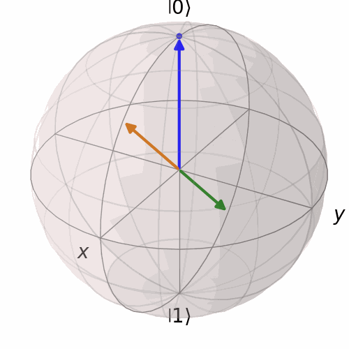
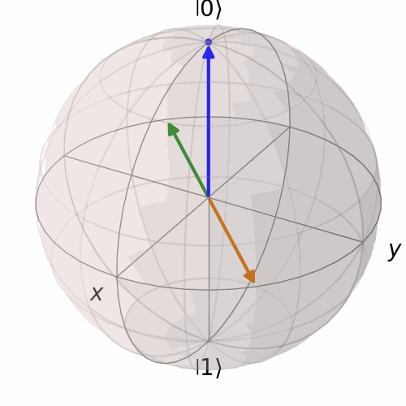

# Part 1

### Exercise 18

Plot $\langle \Psi | X | \Psi \rangle$ as a function of the angles $\theta$ and $\phi$. 

 

### Exercise 33

Now let's try a slightly more complicated rotation. Clearly, $\hat{M} = (\hat{X} + \hat{Z})/2$ is a hermitian operator, so we can define a rotation $\exp(-i\alpha\hat{M}/2)$. Figure out what it does.

The animated bloch sphere is shown below. The axis lies in the X-Z plane as $\phi = 0$.

 

Verify $\exp(-i\alpha\hat{M}/2)$ is equal to the calculation done by hand by using the equation below:

\begin{equation}
f(\hat{H}) = \sum_i f(h_i) |h_i\rangle\langle h_i|.
\end{equation}

which gave the eigenvalues $\{+1, -1\}$ and eigenvectors

\begin{align*} 
| H_+ \rangle = cos\left(\frac{\pi}{8} \right) |0 \rangle + sin \left( \frac{\pi}{8} \right) |1\rangle \\
| H_- \rangle = -sin \left( \frac{\pi}{8} \right) |0 \rangle + cos\left(\frac{\pi}{8} \right) |1\rangle
\end{align*}

\begin{equation}
\exp(-i\alpha\hat{M}/2) = \exp(-i\alpha/2)| H_+ \rangle \langle H_+ | + \exp(i\alpha/2)| H_- \rangle \langle H_- |
\end{equation}

### Exercise 35

Consider another unitary operator $\exp(-i\alpha\hat{M}/2)$, where $\hat{M} = (\hat{X} + \hat{Y})/\sqrt{2}$. What kind of rotation on the Bloch sphere is it?

The animated bloch sphere is shown below. The axis lies in the X-Y plane as $\phi = \pm \pi/4$ and $\theta = \pi/2$.

 

