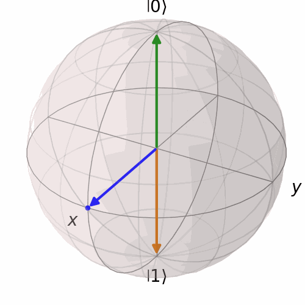
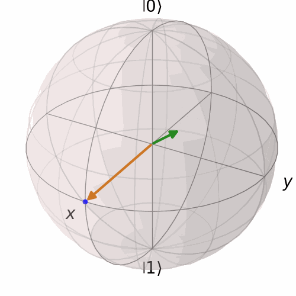
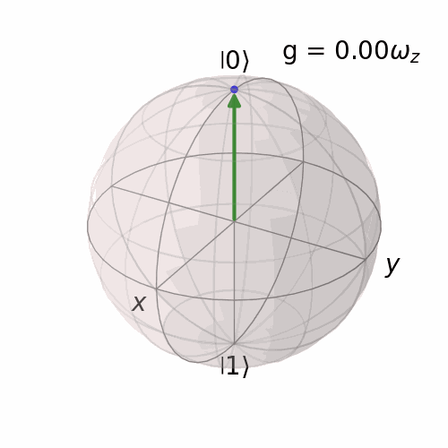

# Part 2

The below animations are shown for some exercises.

## Exercise 4

The animated Bloch sphere is shown below. The axis lies in the X-Y plane.

 

## Exercise 15

The animated Bloch sphere is shown below. The solution is a rotation of the initial $(x, y, z)$-vector around the vector oriented along $(1, 1, 1)$.

 

## Exercise 23

The animated Bloch sphere is shown below. The solution is a rotation of the initial $| 0 \rangle$-vector around the vector oriented along $(g, 0, \omega_z)$.

 

## Exercise 36

Below is a 3d visualization of the density plot.

 

## Exercise 37

Below is animation for individual values of $g$. Y-axis denotes $\langle Z \rangle(t)$ and X-axis denotes time.

 

